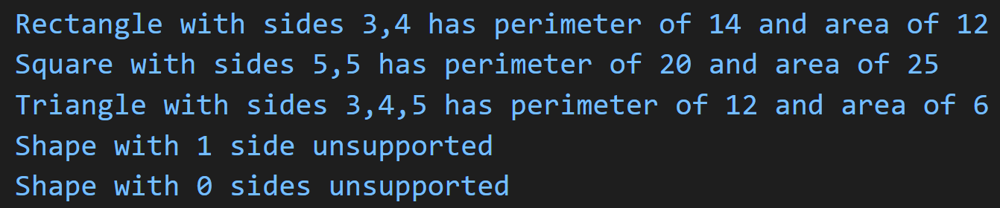

## Functionality

Creating a Shape class and extend the class to develop a program that will output perimeters and areas of different shapes (square, rectangle, triangle).

### Purpose

- Gain experience creating and working with classes with inheritance
- Gain more experience using a generic block of code to process data

Expected output for different shapes

[File for Shape class and methods](p6.js)

